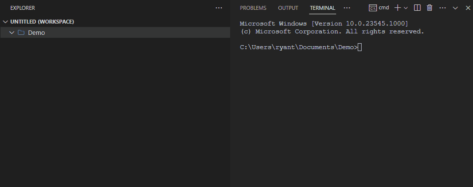

# ProcessWire Core 3.x 
This documentation details the workflow for ProcessWire sites.

## Table of Contents
1. [Installation](#installation)
2. [Local Development](#local)
3. [Upgrading](#upgrading-processwire)
4. [Troubleshooting](https://processwire.com/docs/start/install/troubleshooting/)
5. [Support](#support-and-links)

### Learn more 
* [ProcessWire](https://processwire.com)
* [About ProcessWire](https://processwire.com/about/)
* [Support forums](https://processwire.com/talk/)
* [Documentation](https://processwire.com/docs/)
* [API reference](https://processwire.com/api/ref/)
* [Downloads](https://processwire.com/download/)
* [Modules/plugins](https://processwire.com/modules/)
* [Showcase](https://processwire.com/sites/)

-----------------------------------------------------------------
## Installation

Install the LTS Version of node.js and npm

``` shell
sudo apt install nodejs npm
```

Navigate to installation directory folder and execute the installer within the folder.
``` shell
npx pw-installer
```


## Local Development

### Using Local WP
 1. Install Local WP
 2. Create a new site from a blueprint or blank template
 3. Open site folder, and delete the Wordpress installation
 4. Run the installation CLI command in the `app/public` directory `npx pw-installer`
 5. Open the site and complete the ProcessWire install.

### Hot Reload 🔥
You can use hot reload to automatically reload the browser when you make changes to your files. This is done by using a proxy server that watches for changes in your files and reloads the browser when a change is detected. This is useful for development, but not recommended for production. 

To enable hot reload, install the templates dependencies with node package manager (npm). 
```
npm install
```
Then run the hot reload command
```
npm run hot
```
This will start the proxy server and open the browser. You can now make changes to your files and the browser will automatically reload when a change is detected. This will not reload the domain set in Local WP, so you will need to manually refresh the browser.

### Using Lando & Docker 🚧
Coming soon...

## Upgrading ProcessWire

Upgrading is easy and usually just a matter of replacing your `/wire/` directory
with the one from the new version. But to be safe, before proceeding with any version upgrade, please see the
[Upgrading ProcessWire](https://processwire.com/docs/start/install/upgrade/)
guide and perhaps keep it open during your upgrade in case you need to refer back to it. 

When upgrading from one 3.x version to another, please use the 
[general upgrade process](https://processwire.com/docs/start/install/upgrade/#general-upgrade-process).
This consists primarily of making sure you've got everything backed up and then just 
replacing your `/wire/` directory with the one from the newer version.

- If you are upgrading from a 3.x version prior to 3.0.135 then please also follow 
  [these instructions](https://processwire.com/docs/start/install/upgrade/from-3.x/). 

- If you are upgrading from any 2.x version then please see 
  [upgrading from ProcessWire 2.x](https://processwire.com/docs/start/install/upgrade/from-2.x/).

- If you run into any trouble upgrading, please see our 
  [troubleshooting upgrades guide](https://processwire.com/docs/start/install/troubleshooting/#troubleshooting-upgrades).


### Pro module version upgrade notes (if applicable)

- [FormBuilder](https://processwire.com/store/form-builder/)
  version 0.5.3 or newer recommended.
- [ListerPro](https://processwire.com/store/lister-pro/)
  version 1.1.5 or newer recommended. 
- [ProFields](https://processwire.com/store/pro-fields/)
  the latest versions of all ProFields (10 modules) are recommended.
- [LoginRegisterPro](https://processwire.com/store/login-register-pro/)
  version 7 or newer recommended.   
- [ProCache](https://processwire.com/store/pro-cache/)
  version 4.0.3 or newer recommended. After upgrading, go to your ProCache 
  settings in the admin (Setup > ProCache) and see if it suggests any 
  modifications to your .htaccess file.
 
- For all other Pro modules not mentioned above we recommend using the 
  latest available versions when possible.

## Debug Mode

Debug mode causes all errors to be reported to the screen. This can be
helpful during development or troubleshooting. When in the admin, it also
enables a “Debug” link (see footer) for reporting of extra information in a 
panel. Debug mode is not intended for live or production sites, as the 
information reported is for the developer only. Do not leave debug mode 
on for any live/production sites, as it could be a security concern. However, 
we think you'll find it very handy during development or when resolving issues. 

1. Edit this file: `/site/config.php`
2. Find this line: `$config->debug = false;` 
3. Change the `false` to `true` like below, and save. 

```
$config->debug = true; 
```
This can be found near the bottom of the file, or you can add it if not
already there. It will make PHP and ProcessWire report all errors, warnings,
notices, etc. Of course, you'll want to set it back to false once you've 
resolved any issues. 


## Support and Links

* [ProcessWire Support Forums](https://processwire.com/talk/)
* [ProcessWire Weekly News](https://weekly.pw/)
* [ProcessWire Blog](https://processwire.com/blog/)
* [Sites running ProcessWire](https://processwire.com/sites/)
* [Subscribe to ProcessWire Weekly email](https://processwire.com/community/newsletter/subscribe/)
* [Submit your site to our directory](https://processwire.com/sites/submit/)
* [Follow @processwire on X-Twitter](http://twitter.com/processwire/)
* [Contact ProcessWire developer](https://processwire.com/contact/)
* [Report issue](https://github.com/processwire/processwire-issues/issues)

------
